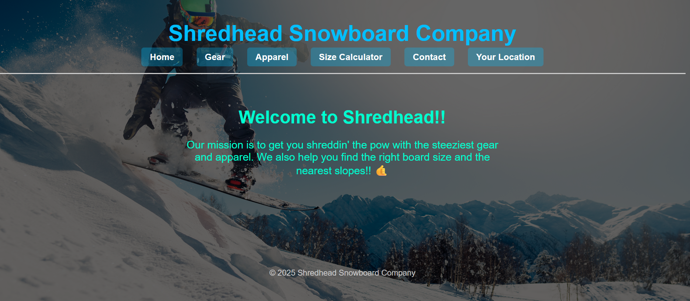
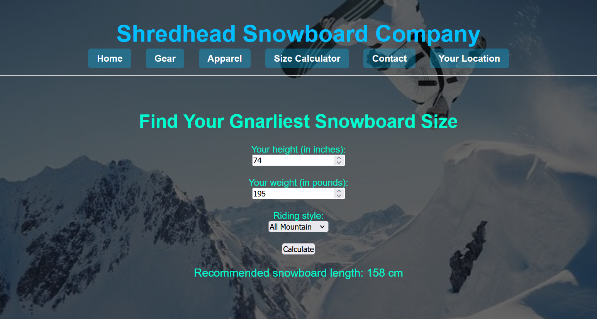
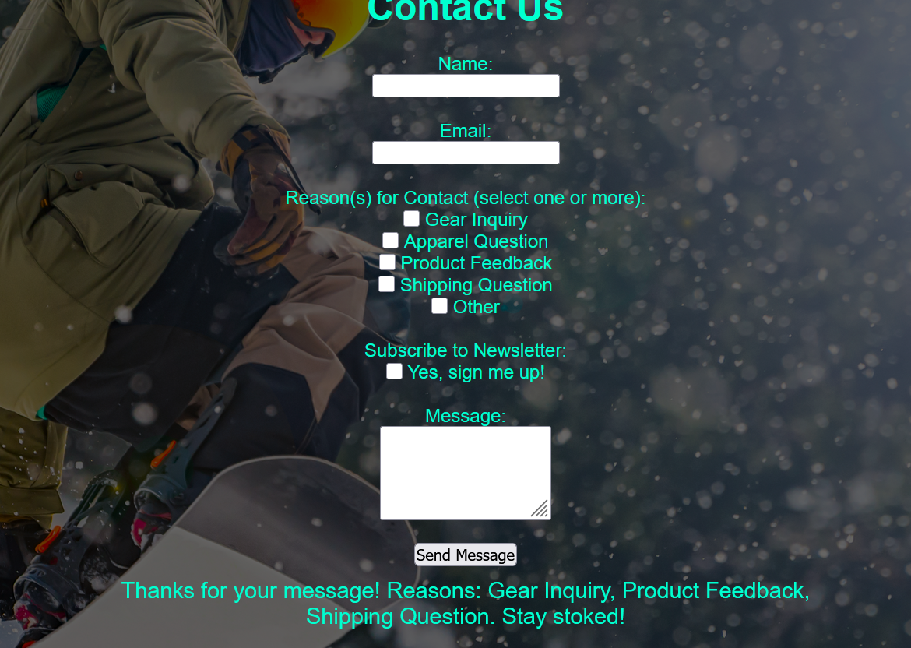
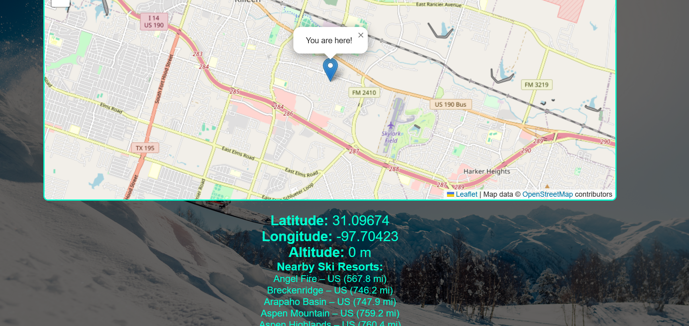

# 🏂 Shredhead Snowboard Company

A fully responsive, multi-page website showcasing a fictional snowboarding brand. This project demonstrates skills in web development, JavaScript interactivity, 
geolocation, API integration, and object-oriented programming.

## 🌐 Live Site
[View the live website here](https://awaddell-dev.github.io/Snowboarding-Website)

## 🧰 Technologies Used
- HTML5 & CSS3
- JavaScript (Vanilla JS)
- Object-Oriented Programming (OOP)
- Leaflet.js (interactive maps)
- jQuery & AJAX
- RapidAPI for ski resort data

## 📁 Features

### 🏠 Multi-Page Layout
- **index.html** — Homepage with intro and nav
- **Shredhead_Gear.html** — Featured snowboarding gear
- **Shredhead_Apparel.html** — Apparel categories for men, women, and kids
- **Contact_Form.html** — Interactive form using a custom object-oriented class
- **Snowboard_Size_Calculator.html** — Dynamic calculator based on height, weight, and style
- **User_Location.html** — Live geolocation with nearby resort data from API

### 📍 Geolocation & Ski Resort API
- Uses the [Ski Resorts and Conditions API](https://rapidapi.com/random-shapes/random-shapes-default/api/ski-resorts-and-conditions/) via jQuery AJAX
- Displays user's coordinates and a map using Leaflet.js
- Calculates distance to nearby resorts using Haversine formula

### 🛠️ Object-Oriented JS
- `ContactFormManager.js` handles checkbox selections, email validation, and form feedback
- `ShredheadSizeFormLogic.js` performs snowboard size calculations with conditional logic

### 🎨 Visual Design
- Responsive layout with mobile-friendly nav and background overlays
- Themed background images by page type (gear, apparel, size calculator)
- Image galleries with hover effects

## 🖼️ Screenshots

### 🏠 Homepage

### 📏 Snowboard Size Calculator

### 📬 Contact Form

### 🗺️ Resort Locator

